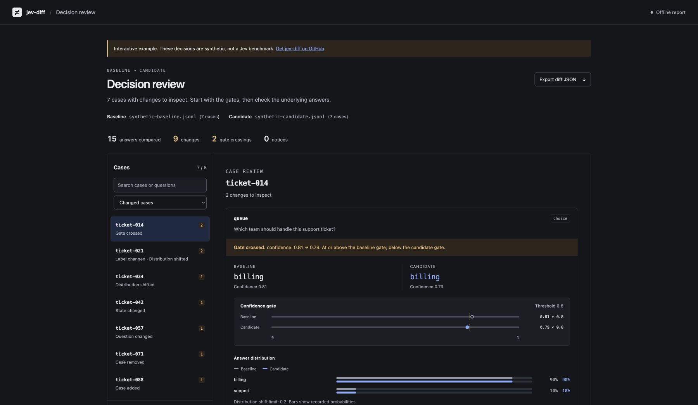

# jev-diff

See which decisions change before you change a Jev model, question, or threshold.

A classifier can return the same label and still send your app down a different branch. If your confidence gate is `0.8`, a move from `0.81` to `0.79` matters. An accuracy score will not tell you that.

`jev-diff` compares saved responses by case ID and reports those changes. It runs offline, has no runtime dependencies, and makes no model calls.

[Explore the interactive example](https://vihaanagarwal.github.io/jev-diff/). It uses synthetic decisions, not benchmark results.



## Try it

Requires Python 3.10 or newer. Install from this repository; it is not on PyPI.

```sh
git clone https://github.com/VihaanAgarwal/jev-diff.git
cd jev-diff
pip install .
jev-diff compare examples/baseline.jsonl examples/candidate.jsonl \
  --policy examples/policy.json
```

```text
Compared answers: 2 | Changes: 2 | Changed cases: 1
  "ticket-001"/"queue"  threshold_crossed confidence: 0.81 -> 0.79 (at_or_above -> below; gate 0.8 -> 0.8)
  "ticket-001"/"urgent"  threshold_crossed noul: 0.89 -> 0.91 (below -> at_or_above; gate 0.9 -> 0.9)
```

The command exits **1** because the decisions changed. The example is hand-written fixture data, not a Jev benchmark.

## Review changes in your browser

Add `--html` to save a self-contained report:

```sh
jev-diff compare baseline.jsonl candidate.jsonl \
  --policy policy.json --html review.html
```

Open `review.html` in your browser. No server, account, API key, or internet connection is needed. The file includes everything it uses.

The report starts with changed cases and puts gate crossings first. Filter by label changes or distribution shifts, search case and question IDs, and inspect baseline and candidate answers side by side. Each configured gate shows the value and threshold from both runs. Score distributions expose changes that the mean hides. Unchanged questions remain available in a disclosure.

Use the arrow keys within the case list, or open a case link in another tab. The report follows your system's light or dark appearance and works on narrow screens. **Export diff JSON** downloads the same comparison returned by `--json`.

Changed state or answer criteria can make a numeric comparison misleading. Those cases explain why comparison was skipped and keep the original evidence available. A report is a fixed snapshot, not a provider console or an application replay.

`--html` preserves the normal output and exit codes. It also works with `--json`. Existing report files are replaced atomically; input files cannot be used as the output path. Reports contain your question definitions, answers, policies, model IDs, and state digests. Treat them as sensitive as the source records.

## Record your cases

Use the raw request and response bodies from the [TypeSafe HTTP API](https://docs.typesafe.ai/api):

```sh
jev-diff record --id ticket-001 --request request.json --response response.json \
  >> baseline.jsonl
```

Or add one line where your application already calls Jev:

```python
import json
from jev_diff import make_record

# request and response are JSON-compatible dictionaries from your own call.
record = make_record("ticket-001", request, response)
with open("baseline.jsonl", "a", encoding="utf-8") as stream:
    stream.write(json.dumps(record) + "\n")
```

Repeat the same cases with your candidate model or questions and save `candidate.jsonl`. Capture the actual model ID from the response, not a hard-coded alias. Record each case once per file. For repeated runs, use distinct IDs consistently on both sides.

The record includes question definitions, typed answers, the returned model ID, and a SHA-256 digest of the state. It leaves out raw state, request headers, usage, and extra response fields. Keep the original cases separately if you need to rerun the model. **A digest is not anonymization:** labels and question text may still contain sensitive data, and predictable states can be guessed. Keep private traces out of Git.

## Use your application's thresholds

Policy files map question IDs to gates:

```json
{
  "queue": {"confidence": 0.8},
  "urgent": {"threshold": 0.9},
  "severity": {"confidence": 0.7, "threshold": 1.5}
}
```

- `confidence` uses the API's confidence field for Choice or Score. It is not the winning option's probability.
- `threshold` uses the Noul probability or the Score's position on its rubric. A three-level Score ranges from 0 to 2.
- Gates split values into `< threshold` and `>= threshold`. There are no implicit gates. If your application uses `>`, compound conditions, or state-dependent rules, these gates are only a partial description of its behavior.

These values are examples, not recommended production thresholds.

To test a policy change without any new API calls:

```sh
jev-diff compare baseline.jsonl baseline.jsonl \
  --policy old-policy.json --candidate-policy new-policy.json
```

A changed threshold that crosses no recorded value is a notice. Adding or removing a gate is a change. Misspelled question IDs and gates are errors.

## What is compared

| Event | Result |
| --- | --- |
| Choice label changes | Change |
| Configured confidence or value gate is crossed | Change |
| Distribution moves farther than `--max-tv` | Change |
| Case or question is added or removed | Change |
| Question wording, criteria, or type changes | Change |
| State digest changes | Change; answer comparison skipped for that case |
| Criteria or question type changes | Change; numeric comparison skipped for that question |
| Returned model ID changes | Notice |
| Invalid or incomplete record | Input error |

Distribution distance is total variation: half the sum of absolute differences between probabilities. For Noul it is the absolute probability difference. The default limit is `0.2`; equality passes. Probability sums within `0.01` of 1 are accepted and normalized for this calculation. When every probability is rounded to two decimals, the tolerance grows to `0.005` per option if that is larger. Zero total mass and discrepancies beyond that rounding allowance are input errors. The original recorded values are preserved.

Question wording changes are reported even when the answers stay the same. Score distributions are compared, so a split between the lowest and highest levels will not look identical to certainty in the middle just because both have the same mean.

The comparison is deterministic. Jev itself need not be. One changed response is evidence of a change in that run, not proof of a systematic regression. Use repeated, representative cases and inspect the failures. This tool does not measure calibration, choose thresholds, label data, or prove that either answer is correct.

## CI

```sh
jev-diff compare baseline.jsonl candidate.jsonl --policy policy.json --json > diff.json
```

To attach a readable CI artifact, add `--html review.html` and upload it even when the comparison exits 1. For example, in GitHub Actions after installing `jev-diff`:

```yaml
- name: Compare saved decisions
  run: jev-diff compare baseline.jsonl candidate.jsonl --policy policy.json --html review.html
- uses: actions/upload-artifact@v4
  if: ${{ !cancelled() }}
  with:
    name: decision-review
    path: review.html
    if-no-files-found: ignore
```

Exit codes: `0` means no changes under the configured checks; `1` means changes to inspect; `2` means invalid input or configuration. JSON output has `summary`, `changes`, and `notices`. A case can have several changes. Invalid input goes to stderr, with no partial report on stdout.

The Python API accepts maps keyed by case ID:

```python
from jev_diff import compare, load_records

report = compare(
    load_records("baseline.jsonl"),
    load_records("candidate.jsonl"),
    policy={"queue": {"confidence": 0.8}},
)
assert not report["changes"], report["changes"]
```

## Scope

This release accepts TypeSafe's raw Choice, Score, and Noul wire formats. Gateway-specific formats need conversion first. It does not proxy requests, replay application side effects, or call providers. The contract was checked against the official documentation; this release has not been tested with a live Jev API key.

For fitting thresholds and checking calibration, see [jevcal](https://github.com/abhixhek/jevcal). For improving question criteria from feedback, see [jev-align](https://github.com/sutro-sh/jev-align). `jev-diff` handles the narrower job of reviewing changes in saved decisions.

## Development

```sh
uv sync --group dev
uv run pytest
uv run ruff check .
node --check src/jev_diff/assets/report.js
uv build
```

The report uses plain HTML, CSS, and JavaScript bundled inside the Python package. It has no JavaScript build step. Node is only needed for the syntax check. Run `uv run python examples/build_review.py` after changing report assets to regenerate the public synthetic example in `docs/index.html`. See [the report design notes](docs/design.md) for interaction and presentation decisions.

Bug reports with a small, redacted pair of records are useful. Run the tests before sending a change. Keep provider calls and runtime dependencies out of the comparison path.

MIT licensed. Independent project; not affiliated with TypeSafe AI.
